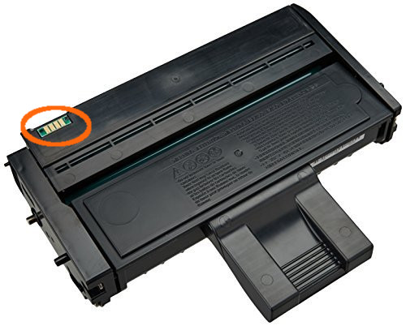
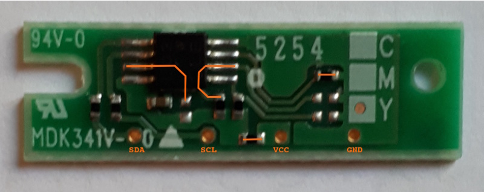
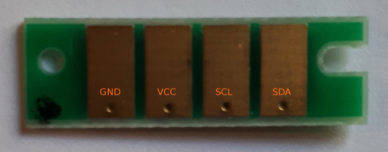

# Acknowledgement

I'd like to thank Ludivic Guegan (lugu), from whom I forked the base for this work, 
for inspiring me to do experiment with my printers (RICOH Aficio SP-204) toner chip 
model and be able to reset it effectively. It has been a great learning experience 
on how the I2C protocol works and how to manipulate I2C EEPROMS.

# Introduction

The RICOH SP 204 printer toners have a chip that keeps track of the number of pages that have been printed.
This is anoying because it will render a refill useless.

In order to reuse this kind of toner, there are two things you need to do:

1. refill the toner with ink (if needed)
2. reset the toner chip (or replace it)

There is [plenty of information](www.uni-kit.com/pdf/tonerrefillinstructions.pdf) explaining how to refill the
toner but little information on how to erase the toner chip.

This document deals with the second point: how to dump the chip and
reset it.

It took me a while to get everything setup and to have my toner chip
reset so I would like to share this process in order to help other to
do the same with their printer toner cartridges.

I will step through the process of understanding the problem, analysing the
chip circuit, dumping the chip contents and writing back a pattern so the 
printer will be able to initialize the chip and set the toner level to full.

# Step 1: The problem

Your computer talks to your printer via a USB link (or maybe through
wifi). The printer itself communicate with the toner chip via an I2C
bus.

	+------------+           +-----------+            +-------------+
	|    Host    |    USB    |           |    I2C     |    toner    |
	|  computer  | <-------> |  Printer  | <--------> |    chip     |
	|            |           |           |            |             |
	+------------+           +-----------+            +-------------+

What I did is connect an Arduino Pro mini directly to the toner
chip like this:

	+-----------+          +-----------+
	|           |   I2C    |   toner   |
	|  Arduino  | <------> |   chip    |
	|           |          |           |
	+-----------+          +-----------+

The I2C bus is very common on embedded systems. For example:
smartphones use it to connect the touchscreen or the motion sensor
to the main processor chip. There is plenty of documentation, I 
recommend this one:
[this one from saleae](http://support.saleae.com/hc/en-us/articles/200730905-Learn-I2C-Inter-Integrated-Circuit).

The full specification is avavailable at: http://www.i2c-bus.org/

# Step 2: The chip circuit

To do this it is necessary to know what I2C EEPROM is used in the circuit.
Try to gather as much information as you can:

* Read the part number and search it on the Internet.
* Search if other people have shared information about your printer.

The IC you see in the front side of the toner chip seems to be an EEPROM memory.
This has been confirmed by the following blogs discussing other RICOH printer models:

* http://www.mikrocontroller.net/topic/369267
* https://esdblog.org/ricoh-sp-c250dn-laser-printer-toner-hack/

Looking at the chip with a magnifying glass and slanted lighting I could read
a partialy erased designation text "L02W". This chip turns out to be a 
BR24L02W EEPROM, the equivalent of the 24C02 EEPROM.
 

The rest of this tutorial is about how to read and write this EEPROM
memory.

# Step 3: Set up your Arduino
=============================

Thi is the breadboard setup I used:

![Pictire: Breadboard layput] (images/TonerChipResetBB.png)

here is the corresponding schematic:

![Pictire: Breadboard layput] (images/TonerChipResetSchem.pdf) 

Depending on the Arduino you might have, the I2C pins are:

| Board         |   I2C pins           |
| :--:          | :--:                 |
| Pro mini      |   A4 (SDA), A5 (SCL) |
| Mega2560      |   20 (SDA), 21 (SCL) |
| Due           |   20 (SDA), 21 (SCL) |
| Leonardo      |   2 (SDA), 3 (SCL)   |

Then connect GND and VCC to 3.3V.

Step 3: find the I2C clock and address
======================================

To communicate on an I2C bus, we need to know the correct clock speed and the
address of the EEPROM.

If you know the EEPROM model from the circuit analysis, you can
read the datasheet and find the clock rate and address like this:

For example the [datasheet of the component BR24L02-W](datasheet/BR24Lxxx-W-EEPROM.pdf)
indicates an operating clock of 1MHz at 3.3V.
The datasheet indicates how to calculate the address according to the
PIN A0, A1 and A2. In binary, the address is computed like this: ``1 0
1 0 A2 A1 A0``.

So if the configuration is:

	A0 = 1
	A1 = 1
	A2 = 0

The address is ``1 0 1 0 0 1 1`` (0x53).

Note: 1MHz seems to be the upper bound of the my Arduino can reach.
I modified Multispeed_I2C_scanner.ino to scan at a max. speed of 1MHz.
If interested in details see the [full discussion](http://electronics.stackexchange.com/questions/29457/how-to-make-arduino-do-high-speed-i2c).

If you don't know the clock rate and the device address on the I2C
bus, you can scan all the possible I2C addresses at different clock
rate. The directory scanner have a sketch to do this. Here is the
output of the program execution on my Arduino:

    1 devices found in 111 milliseconds.
    
    Arduino MultiSpeed I2C Scanner - 0.1.7
    
    I2C ports: 1
    	@ = toggle Wire - Wire1 - Wire2 [TEENSY 3.5 or Arduino Due]
    Scanmode:
    	s = single scan
    	c = continuous scan - 1 second delay
    	q = quit continuous scan
    	d = toggle latency delay between successful tests. 0 - 5 ms
    Output:
    	p = toggle printAll - printFound.
    	h = toggle header - noHeader.
    	a = toggle address range, 0..127 - 8..120
    Speeds:
    	0 =  50 - 1MHz
    	1 =  100 KHz only
    	2 =  200 KHz only
    	4 =  400 KHz only
    	8 =  800 KHz only
    	9 = 1000 KHz only
    
    	? = help - this page
    
    TIME	DEC	HEX		50	100	200	300	400	500	600	700	800	1000	[KHz]
    ---------------------------------------------------------------------
    30148	83	0x53	V	V	V	V	V	V	V	V	V	V
    
    1 devices found in 606 milliseconds.

From here, we know the device address on the I2C bus is 0x53 and
responds to SCL from 50 kHz to 1 MHz.

Note: the BR24L02-W spec-sheet states that the max. SCL for 2.5Vdc <= Vcc =>  5.5 Vdc 
should not exceed 400 KHz!

Therefore, I have used 400 KHz as the clock frequency for I2C bus access.

Step 4: reading the EEPROM
==========================

Since we know how to communicate with the chip, let's read the content
of the memory. For 24xxx EEPROM, the [datasheet for FM24C02B](datasheet/FM24C02B-04B-08B-16B.pdf) explains how to complete a read operation:

	master send start condition
	master send eeprom address + read bit
	master send data address
	master send start condition
	master send eeprom address + read bit
	device respond with data
	master send stop condition

	STOP condition mandatory between writes.
	Write cycle: 5 ms.

The contents of the original toner chip after printer started to complain about 
low toner level was:

    000: 21 00 01 03 03 01 01 00  00 00 34 30 37 32 35 35  |!.........407255|
    010: 13 04 4d 43 10 00 01 02  00 00 00 00 20 14 07 31  |..MC........ ..1|
    020: 54 37 37 33 4d 38 30 31  31 32 30 20 1e 30 00 00  |T773M801120 .0..|
    030: 00 00 01 54 00 00 00 00  00 00 00 00 00 00 00 00  |...T............|
    040: 00 00 03 38 00 00 00 00  00 00 00 00 00 00 00 00  |...8............|
    050: 00 00 00 00 00 00 00 00  20 14 12 29 00 00 00 00  |........ ..)....|
    060: 00 00 00 00 00 00 00 00  02 b4 00 00 00 00 00 00  |................|
    070: 00 1e 7a 55 00 00 0a 08  00 00 00 00 00 00 00 00  |..zU............|
    080: ff ff ff ff ff ff ff ff  ff ff ff ff ff ff ff ff  |................|
    090: ff ff ff ff ff ff ff ff  ff ff ff ff ff ff ff ff  |................|
    0a0: ff ff ff ff ff ff ff ff  ff ff ff ff ff ff ff ff  |................|
    0b0: ff ff ff ff ff ff ff ff  ff ff ff ff ff ff ff ff  |................|
    0c0: ff ff ff ff ff ff ff ff  ff ff ff ff ff ff ff ff  |................|
    0d0: ff ff ff ff ff ff ff ff  ff ff ff ff ff ff ff ff  |................|
    0e0: ff ff ff ff ff ff ff ff  ff ff ff ff ff ff ff ff  |................|
    0f0: ff ff ff ff ff ff ff ff  ff ff ff ff ff ff ff ff  |................|

Here we can see:

* there seems to be a header (0x0 to 0x0f),
* followed by some numbers (0x10 to 0x1f),
* followed by the printer ID (T773M801120),
* followed by some other unknown values.

This does not make much sense. The next step is to figure out what
those values are for.

Step 6: try some changes
========================

If you are lucky enough that your toner chip is still working (printing), 
you can dump the content of the EEPROM before and after printing a
page. This might give you clues about the memory layout.

The process is like this:

* read the EEPROM content,
* make some changes base on a hypothesis,
* write the content into the EEPROM,
* try to print a page and restart if this does not work.

In order to speed up the process and not have to remove/reapply the chip to the toner 
cartridge every time, I directly connected my Arduino to the chip on the toner while resetting it.

After experimenting a bit I decided to only include the  first 7 (0x00 - 0x06) bytes from the original chip dump.
The rest of the first half of the chip contents are set to 0x00! The second half is not used.

It turned out to work: my printer restarts and the tonner level indicator is at 100%.

Here is are the contents of the header arry used to reset the chip:

    unsigned char chip_reset[] = {
      0x21, 0x00, 0x01, 0x03, 0x03, 0x01, 0x01, 0x00, 0x00, 0x00, 0x00, 0x00, 0x00, 0x00, 0x00, 0x00,
      0x00, 0x00, 0x00, 0x00, 0x00, 0x00, 0x00, 0x00, 0x00, 0x00, 0x00, 0x00, 0x00, 0x00, 0x00, 0x00,
      0x00, 0x00, 0x00, 0x00, 0x00, 0x00, 0x00, 0x00, 0x00, 0x00, 0x00, 0x00, 0x00, 0x00, 0x00, 0x00,  
      0x00, 0x00, 0x00, 0x00, 0x00, 0x00, 0x00, 0x00, 0x00, 0x00, 0x00, 0x00, 0x00, 0x00, 0x00, 0x00,
      0x00, 0x00, 0x00, 0x00, 0x00, 0x00, 0x00, 0x00, 0x00, 0x00, 0x00, 0x00, 0x00, 0x00, 0x00, 0x00,
      0x00, 0x00, 0x00, 0x00, 0x00, 0x00, 0x00, 0x00, 0x00, 0x00, 0x00, 0x00, 0x00, 0x00, 0x00, 0x00,
      0x00, 0x00, 0x00, 0x00, 0x00, 0x00, 0x00, 0x00, 0x00, 0x00, 0x00, 0x00, 0x00, 0x00, 0x00, 0x00,
      0x00, 0x00, 0x00, 0x00, 0x00, 0x00, 0x00, 0x00, 0x00, 0x00, 0x00, 0x00, 0x00, 0x00, 0x00, 0x00,
      0xff, 0xff, 0xff, 0xff, 0xff, 0xff, 0xff, 0xff, 0xff, 0xff, 0xff, 0xff, 0xff, 0xff, 0xff, 0xff,
      0xff, 0xff, 0xff, 0xff, 0xff, 0xff, 0xff, 0xff, 0xff, 0xff, 0xff, 0xff, 0xff, 0xff, 0xff, 0xff,
      0xff, 0xff, 0xff, 0xff, 0xff, 0xff, 0xff, 0xff, 0xff, 0xff, 0xff, 0xff, 0xff, 0xff, 0xff, 0xff,
      0xff, 0xff, 0xff, 0xff, 0xff, 0xff, 0xff, 0xff, 0xff, 0xff, 0xff, 0xff, 0xff, 0xff, 0xff, 0xff,
      0xff, 0xff, 0xff, 0xff, 0xff, 0xff, 0xff, 0xff, 0xff, 0xff, 0xff, 0xff, 0xff, 0xff, 0xff, 0xff,
      0xff, 0xff, 0xff, 0xff, 0xff, 0xff, 0xff, 0xff, 0xff, 0xff, 0xff, 0xff, 0xff, 0xff, 0xff, 0xff,
      0xff, 0xff, 0xff, 0xff, 0xff, 0xff, 0xff, 0xff, 0xff, 0xff, 0xff, 0xff, 0xff, 0xff, 0xff, 0xff,
      0xff, 0xff, 0xff, 0xff, 0xff, 0xff, 0xff, 0xff, 0xff, 0xff, 0xff, 0xff, 0xff, 0xff, 0xff, 0xff
    };
	unsigned int dump_bin_len = 256;

Step 7: share your findings
===========================

If you decide to perform something similar on other toner chip model
please share your findings with the community!

Links
=====

Original project:
    https://github.com/lugu/toner_chip_reset

Blog:
	http://www.hobbytronics.co.uk/arduino-external-eeprom
	http://www.hobbytronics.co.uk/eeprom-page-write
	http://lusorobotica.com/index.php/topic,461.msg2738.html

Arduino:
	https://www.arduino.cc/en/Reference/Wire

Tonner investigations:
	http://www.mikrocontroller.net/topic/369267
	https://esdblog.org/ricoh-sp-c250dn-laser-printer-toner-hack/
	http://rumburg.org/printerhack/

Toner chip reset for sale:
	http://www.aliexpress.com/item/chip-FOR-RICOH-imagio-SP-112-SF-chip-MAILING-MACHINE-printer-POSTAGE-printer-for-Ricoh-100/32261857176.html
	http://www.ebay.com/itm/Toner-cartridge-refill-kit-for-Ricoh-Aficio-SP112-SP112SU-SP112SF-407166-non-OEM-/161312940764

Ricoh:
	https://www.techdata.com/business/Ricoh/files/july2014/CurrentMSRP.pdf
	http://support.ricoh.com/bb_v1oi/pub_e/oi/0001044/0001044844/VM1018655/M1018655.pdf

Datasheets:
	http://www.gaw.ru/pdf/Rohm/memory/br24l01.pdf
	http://www.rinkem.com/web/userfiles/productfile/upload/201009/FM24C02B-04B-08B-16B.pdf

Logical Analyser & I2C:
	http://support.saleae.com/hc/en-us/articles/202740085-Using-Protocol-Analyzers
	http://support.saleae.com/hc/en-us/articles/200730905-Learn-I2C-Inter-Integrated-Circuit

Todo
====

- [x] Read internal EEPROM
- [x] Draw the cricuit
- [x] Understand the cricuit
- [x] Try I2C clock at 800kHz and 1MHz
- [x] Scan for device => use MultiSpeedScanner
- [x] Dump the EPPROM chip contents
- [x] Verify the write function
- [x] Experiment with reset patterns
- [x] Test with the printer
- [ ] Document the findings
- [ ] Learn about README.md format (image insertion & style)

 This work is licensed under a <a rel="license" href="http://creativecommons.org/licenses/by/4.0/">Creative Commons Attribution 4.0 International License</a>.
